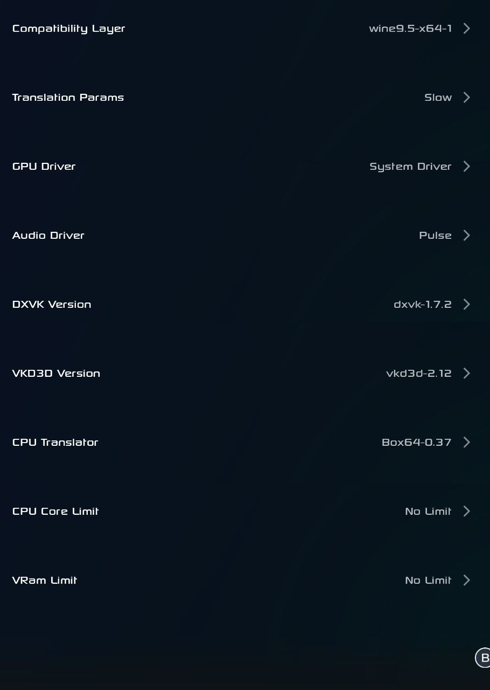

# Fallout New Vegas

**Source**: GOG

**Status**: Playable

**Requirement**: Min 8GB RAM

**Device**:
*   POCO X6 Pro
*   Dimensity 8300
*   8GB RAM / 256GB ROM
*   Gamehub 4.1.5
*   Wine 9.5
*   System Drivers Version 44.1.0

**Emulator Settings**:

**In-Game Settings**:
High settings

**YouTube Gameplay**: 

**Other Settings**:
None.

**Performance**: 15fps Gameplay. Due to slow CPU params, Box64.

**Contributor**: abhay-byte, August 14, 2025
