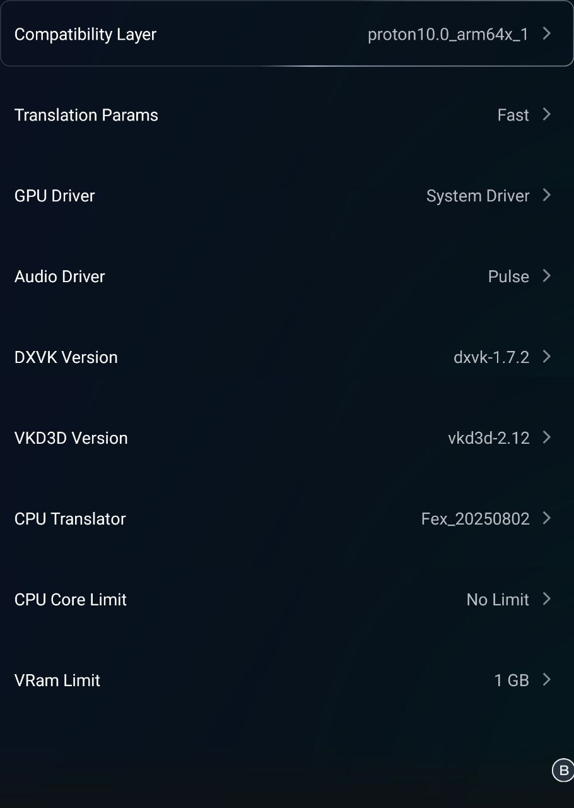

# GTA V - Game Settings

## Game Information

*   **Game Title:** Grand Theft Auto V
*   **Game Source:** Steam
*   **Playability Status:** 

---

## Device & Software Information

*   **Device Model:** POCO X6 Pro
*   **SoC (Chipset):** Dimensity 8300
*   **RAM:** 8GB
*   **Emulator:** GameHub 4.1.5
*   **Container/Wine Version:** Wine Ge-Proton-ARM64
*   **Graphics Driver:** System Drivers
*   **Driver Version:** 44.1.0

---

## Emulator Settings

---

## In-Game Settings

*   **DirectX Version:** DirectX 10
*   **Resolution:** 1600x720
*   **Texture Quality:** Normal

---

## Performance

*   **Playability Status:** Playable
*   **Average FPS:** 30-50+ FPS
*   **Notes & Known Issues:**
    *   Always above 30fps. Goes up to 50+ outside of Los Santos.

---

## Gameplay Video

---

## Contributor

*   **Submitted by:** `@abhay-byte`
*   **Date:** 2025-08-08