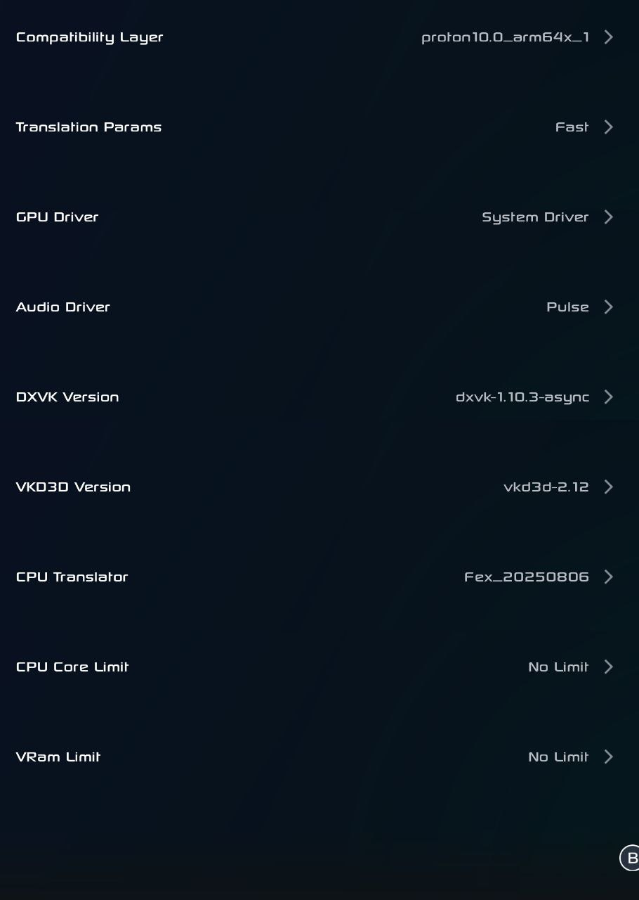
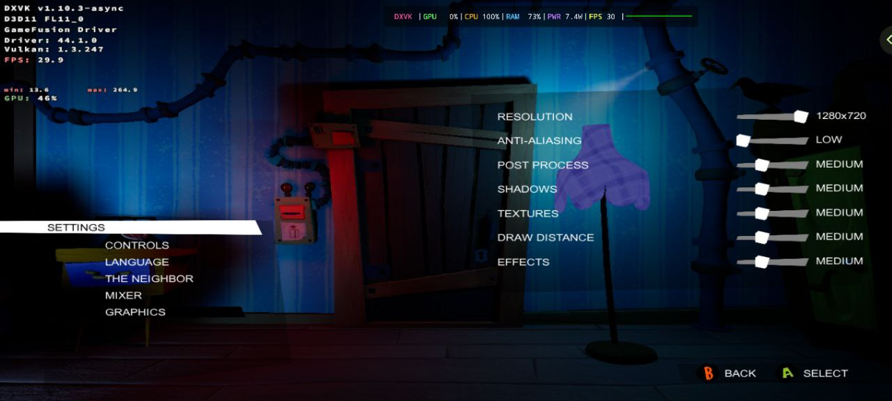

# Hello Neighbor - Game Settings

## Game Information

*   **Game Title:** Hello Neighbor
*   **Game Version:** N/A
*   **Game Source:** GOG
*   **Playability Status:** 

---

## Device & Software Information

*   **Device Model:** POCO X6 Pro (custom-rom)
*   **SoC (Chipset):** Dimensity 8300
*   **Android Version:** 15
*   **Emulator:** GameHub
*   **Emulator Version:** 4.1.5
*   **Container/Wine Version:** Proton 10.0
*   **Graphics Driver:** System Drivers
*   **Driver Version:** 44.1.0

---

## Emulator Settings

---

## In-Game Settings

*   **Graphics Quality:** Medium Settings
*   **Resolution:** 1280x720p
*   **Other Notes:** None.

---

## Performance

*   **Playability Status:** 
*   **Average FPS:** 50 FPS
*   **Notes & Known Issues:** Average 50fps Gameplay.

---

## Gameplay Video

---

## Contributor

*   **Submitted by:** @abhay-byte
*   **Date:** 2025-08-20