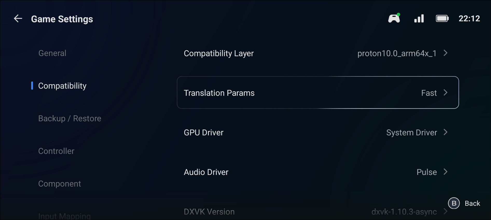
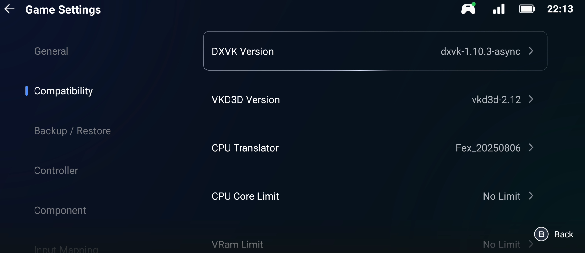
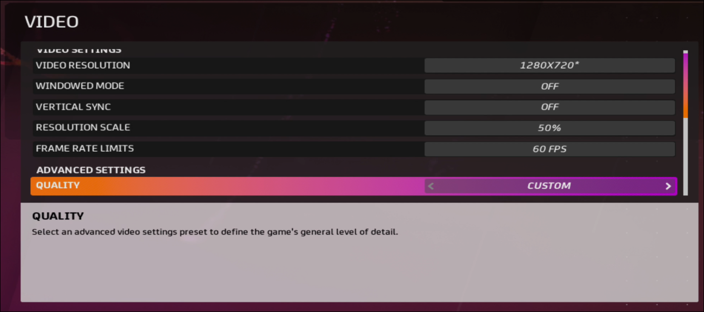

# MOTO GP 2020 - Game Settings

## Game Information

*   **Game Title:** MOTO GP 2020
*   **Game Source:** Steam
*   **Playability Status:** In-Game

---

## Device & Software Information

*   **Device Model:** POCO X6 Pro
*   **SoC (Chipset):** Dimensity 8300
*   **RAM/ROM:** 8GB RAM / 256GB ROM
*   **Emulator:** GameHub
*   **Emulator Version:** 4.1.5
*   **Container/Wine Version:** Proton 10 ARM
*   **Graphics Driver:** System Drivers
*   **Driver Version:** 44.1.0

---

## Emulator Settings

---

## In-Game Settings

*   **Graphics Quality:** Low

---

## Performance

*   **Playability Status:** In-Game
*   **Notes & Known Issues:** 60fps in menu, launching a race crashes the game due to low RAM. 12GB is required.

---

## Gameplay Video

---

## Contributor

*   **Submitted by:** `@abhay-byte`
*   **Date:** 2025-08-09
