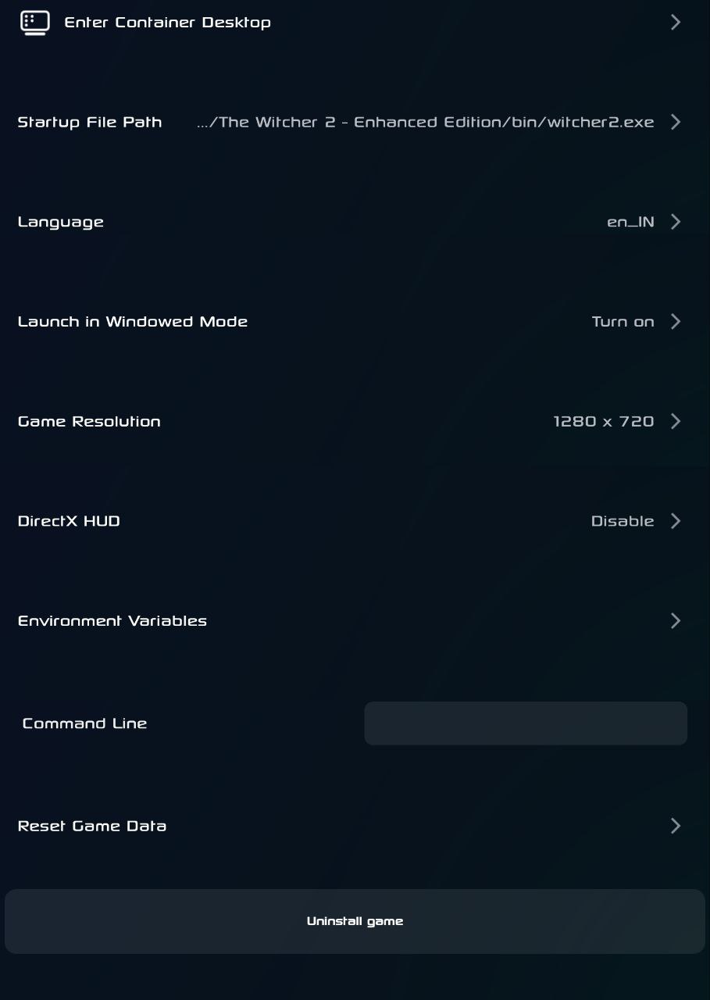
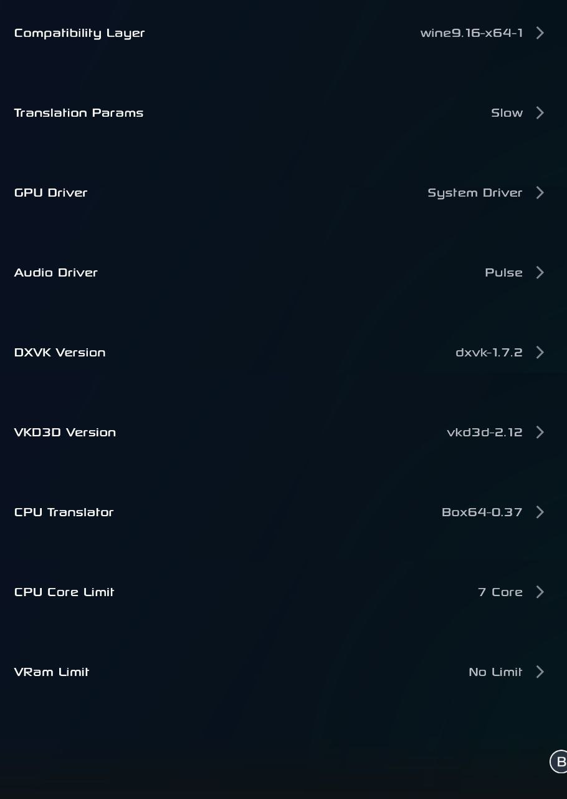
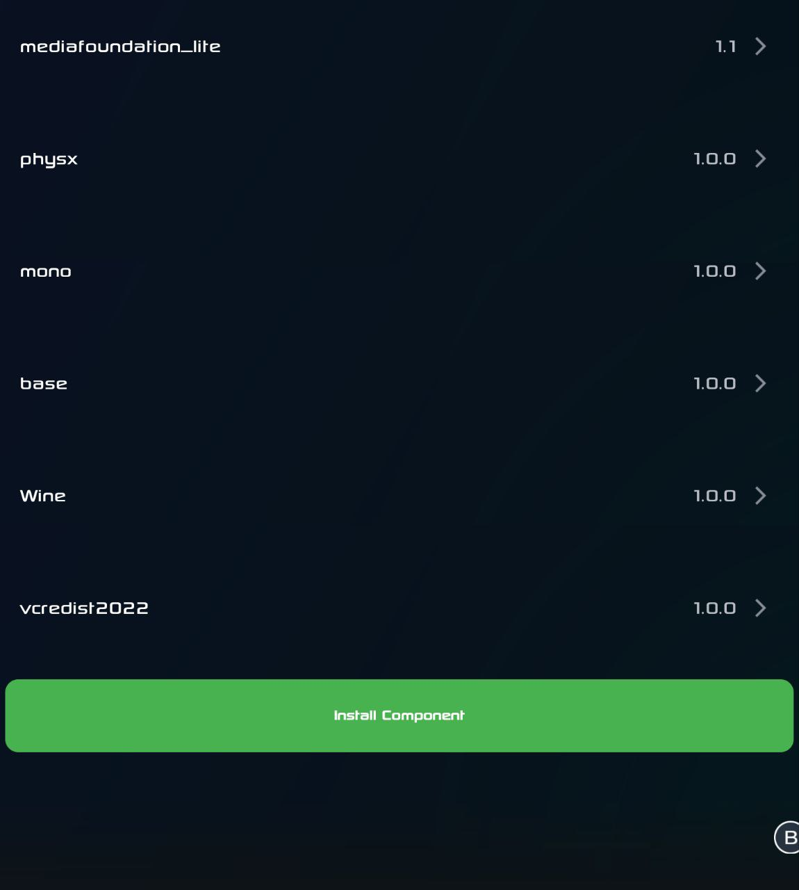

# The Witcher 2: Assassins of Kings

**Source**: GOG

**Status**: Playable

**Requirement**: Min 8GB RAM

**Device**:
*   POCO X6 Pro
*   Dimensity 8300
*   8GB RAM / 256GB ROM
*   Gamehub 4.1.5
*   Wine 9.16
*   System Drivers Version 44.1.0

**Emulator Settings**:

**In-Game Settings**:
Low settings

## Gameplay Video

**Other Settings**:
`mfc100u.dll` to be copied in root dir.
Link: [mfc100u.dll](https://www.dll-files.com/download/6358cc2a77f3c12c5b9b16190d5477f7/mfc100u.dll.html?c=VW43WXl5STF1MEZGQk1tWXJKUmVCQT09)

**Performance**: 15 FPS avg throughout game, due to slow CPU params in box64, to be fixed.

**Contributor**: abhay-byte, August 14, 2025
